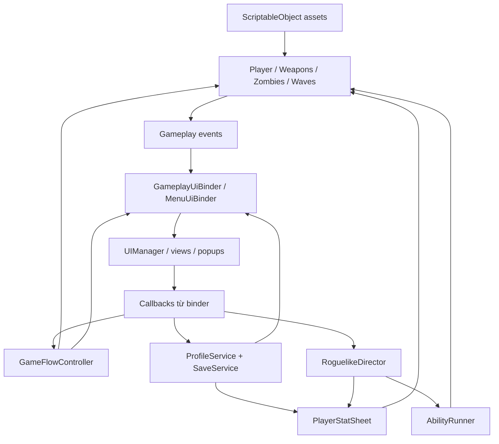
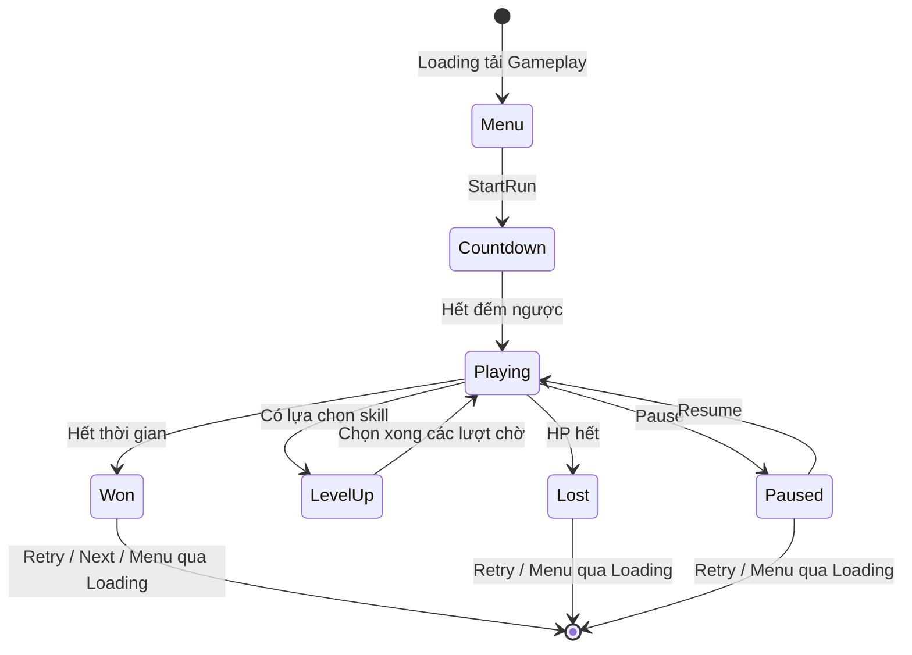
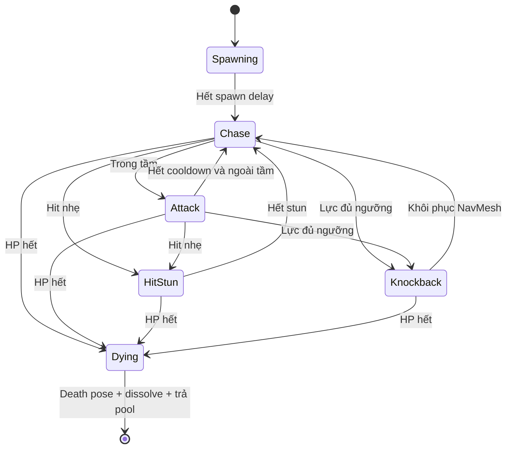

# Zombie War — Tài liệu hệ thống dành cho developer

Cập nhật: 07/09/2026. Dành cho developer mới, người bảo trì và người mở rộng game.

Tài liệu mô tả implementation được đối chiếu với C# và asset trong repository. Đây không phải biên bản chạy thử hay nghiệm thu APK. Giá trị serialize trong asset/prefab là cấu hình thực tế; initializer trong C# chỉ là mặc định khi tạo mới.

## 1. Bắt đầu

Zombie War là game sinh tồn bắn súng 3D top-down cho mobile, màn hình dọc. Người chơi điều khiển di chuyển; ngắm, bắn và active skill được tự động hóa. Chọn một súng trước trận, giữ suốt trận. Sống hết thời gian thì thắng; HP về 0 trong Playing thì thua. Kill tạo điểm và orb; nhặt orb để lên cấp trong trận, chọn kỹ năng. Sau trận nhận coins và XP tài khoản để nâng cấp lâu dài.

### Mở project lần đầu

1. Cài Unity **2022.3.62f3**, thêm Android Build Support và SDK/NDK/OpenJDK tương ứng nếu cần APK.
2. Mở root project bằng Unity Hub, chờ import/resolve package và kiểm tra Console.
3. Mở `Assets/_ZombieWar/Scenes/Loading.unity`, nhấn Play, đi qua menu để kiểm tra đầy đủ luồng khởi động.
4. Khi phát triển có thể mở Gameplay trực tiếp; trước bàn giao vẫn thử lại từ Loading.
5. Build Settings giữ Loading index 0, Gameplay index 1, cả hai enabled. Game view portrait 9:16; thử thêm màn hình cao và safe area.
6. Không commit Library/Temp/obj hoặc solution/csproj tự sinh. Luôn giữ `.meta` cùng asset; move asset bằng Unity để giữ GUID.

| Thành phần | Cấu hình đọc được | Vai trò |
|---|---|---|
| Unity | ProjectVersion.txt: 2022.3.62f3 | Editor chuẩn |
| URP | manifest: 14.0.11 | Render; đối chiếu packages-lock khi kiểm tra package resolve |
| Input System | 1.14.2 | Input action, joystick ảo |
| Cinemachine | 2.10.7 | Camera follow/impulse |
| AI Navigation | 1.1.7 | NavMeshSurface |
| TMP | 3.0.9 | Text |
| Test Framework | 1.4.6 | Hạ tầng test, không có nghĩa game đã có test |
| DOTween | Assets/Plugins/Demigiant | Tween |
| Unity MCP | Git dependency trong manifest | Công cụ hỗ trợ Editor |

Assembly game là `Assets/_ZombieWar/Scripts/ZombieWar.asmdef`, tham chiếu InputSystem, Cinemachine, Navigation, TMP, UI, DOTween.Modules và URP. Không xóa asmdef DOTween khi xử lý compile.

### Nguồn thông tin

- [CODE-RULE.md](../CODE-RULE.md): quy tắc bắt buộc trước khi sửa script. Đường dẫn generic Assets/Scripts áp dụng tại đây là Assets/_ZombieWar/Scripts.
- [CLAUDE.md](../CLAUDE.md): bối cảnh và lịch sử quyết định; đối chiếu implementation nếu mô tả cũ.
- [GDD](Zombie_War_SPEC_GDD_V1.0.docx): thiết kế gốc. Quyết định sau đó có thể khác GDD, như portrait và chọn súng trước trận.
- [UI-SYSTEM.md](UI-SYSTEM.md), [ROGUELIKE-SYSTEM.md](ROGUELIKE-SYSTEM.md), [SKILL-TREE.md](SKILL-TREE.md), [SHADER-SYSTEM.md](SHADER-SYSTEM.md): tài liệu chuyên sâu; số lượng asset và phiên bản trong đó có thể là snapshot cũ.

Để biết game **hiện chạy thế nào**, tra code, asset và reference thực tế. Để thay đổi thiết kế, tra yêu cầu đã thống nhất và GDD. Không tự sửa gameplay để khớp một mô tả lịch sử.

## 2. Bản đồ kiến trúc

MonoBehaviour kết nối vòng đời Unity; ScriptableObject giữ cấu hình; class C# thuần tính toán; event truyền thay đổi tới presentation. Inspector là nơi lắp ghép hệ thống, thay vì service tự tìm nhau lúc chạy.



Đây là luồng trách nhiệm chính, không phải mọi reference. Một số controller hiện gọi trực tiếp AudioService/VfxService; không hiểu nguyên tắc tách presentation là implementation đã hoàn toàn tách coupling đó.

| Thư mục dưới Assets/_ZombieWar | Trách nhiệm |
|---|---|
| Scripts/Core | Flow, loading, save/profile/settings, score/timer, binder, camera feedback |
| Scripts/Player | Input, Rigidbody motor, aim, HP, stats, ability runner/controller, animation/IK |
| Scripts/Weapons | Gun, projectile, bomb, molotov, ThrowSolver |
| Scripts/Enemies | Manager, AI/state, animation/material FX |
| Scripts/Level | Map loader, wave, spawn resolver, hazard |
| Scripts/Roguelike | Battle XP, orb, weighted draft, skill stacks |
| Scripts/Data | Schema SO, enum và modifier; không phải số cân bằng thực |
| Scripts/UI | DTO, menu, HUD, popup |
| Scripts/Audio, VFX, Utils | Voices, pooled effects, ComponentPool, swap-remove |
| Data | Instance `.asset` để cân bằng |
| Prefabs | GameplayRoot, UIRoot, player, enemy, map, weapon, pickup/VFX |
| Animation, Models, Art, Audio | Nội dung hình ảnh/âm thanh |

Đọc đầu tiên: `Core/GameFlowController.cs`, `Level/LevelMapLoader.cs`, `Core/GameplayUiBinder.cs`, `Weapons/WeaponController.cs`, `Enemies/ZombieManager.cs`, `Roguelike/RoguelikeDirector.cs`, `Player/PlayerStatSheet.cs`, `Core/ProfileService.cs`.

Sau đó mở `Prefabs/GameplayRoot.prefab`, `Prefabs/UI/UIRoot.prefab`, `Prefabs/Player/Soldier_Survivalist.prefab` và kiểm tra instance/override trong Gameplay. Không đặt code game mới vào ThirdParty/Plugins. Khi dọn pack phải tra dependency shader/plugin, không chỉ nhìn mesh trong scene.

## 3. Scene, vòng đời và state machine

### Hai scene, nhiều map prefab

Loading có LoadingSceneController và LoadingView. Controller load async Gameplay, giữ activation tại progress 0.9, chuẩn hóa thanh tiến độ, đợi đủ thời lượng hiển thị rồi activate. Thanh này không đo toàn bộ prewarm gameplay.

Gameplay chứa hệ thống game và overlay main menu. LevelMapLoader.Awake tắt player. Map chỉ được instantiate khi bắt đầu run; mỗi LevelDefinitionSO trỏ đến một LevelMap prefab, không phải scene riêng.



### Thứ tự StartRun cần bảo toàn

1. Ghi level và nhớ lựa chọn qua LevelLoader.Remember.
2. LevelMapLoader.Load tạo map, bật player, đặt transform/Rigidbody tại PlayerSpawn, xóa velocity; reset PreviousStateIsValid của camera.
3. Tạo LevelTimer/ScoreTracker, reset countdown, timeScale = 1.
4. Phát OnRunStarted: wave nạp lịch, zombie pool prewarm sau khi có NavMesh, súng nhận upgrade, rogue reset và rebuild loadout.
5. Chuyển Countdown, phát dữ liệu thời gian/điểm/countdown ban đầu; hết countdown thì Playing.

Không prewarm zombie trước map: NavMeshAgent cần dữ liệu NavMesh để attach. Không gọi StartRun giữa trận để thay cho reset đầy đủ; HP, physics/pool và timer dựa vào reload scene để sạch.

Retry/Next dùng LevelLoader.RestartWith ghi level + auto-start vào LevelSelectionSO rồi load Loading. Gameplay mới ConsumeAutoStart để vào trận. ReturnToMenu xóa auto-start. LevelSelectionSO là cầu nối runtime giữa scene, không phải save lâu dài. Equipped gun nằm trong profile nên Retry/Next giữ lựa chọn súng.

| Event | Chủ sở hữu | Consumer/trách nhiệm chính |
|---|---|---|
| OnRunStarted | Flow | Khởi tạo hệ thống theo level |
| OnStateChanged | Flow | HUD/menu/pause và gate gameplay |
| OnLevelEnded | Flow | Result, dọn rogue, feedback kết trận |
| OnZombieKilled | ZombieManager | Điểm, orb, heal-per-kill, feedback |
| OnChoiceOffered | RoguelikeDirector | Binder gọi PauseForLevelUp, mở popup |
| OnChoiceClosed | RoguelikeDirector | Binder gọi ResumeFromLevelUp |
| OnChanged | ProfileService / PlayerStatSheet | Refresh profile / consumer stat |

Paused/LevelUp đặt timeScale = 0. HitStopController dùng unscaled time cho thời hạn freeze/slow motion. Khi sửa pause phải thử tương tác hit-stop, không ghi timeScale độc lập ở nhiều hệ thống. Won/Lost không mặc định freeze toàn scene: ZombieManager còn tick ở Lost; projectile dùng deltaTime và không có gate Flow riêng.

## 4. Player, input và camera

PlayerInputReader đọc Move qua InputActionReference, enable/disable theo lifecycle, áp dụng radial dead zone. Asset chung là `Assets/InputSystem_Actions.inputactions`; joystick đi qua Input System, không tạo đường Input.GetKey song song.

PlayerMotor.FixedUpdate đổi input thành velocity X/Z theo trục thế giới vì camera north-up; áp dụng Acceleration và giữ velocity Y cho gravity. Có target thì quay về target, không có thì quay theo hướng chạy. LocalMoveDirection/NormalizedSpeed/WorldMoveDirection cấp cho animation và consumer. Đổi camera sang quay tự do phải xem lại ánh xạ joystick.

PlayerAim dùng OverlapSphereNonAlloc, tra collider qua ZombieManager, loại target không targetable hoặc bị obstacle che. Điểm ưu tiên = khoảng cách + góc × penalty. Hold duration, switch margin, occlusion grace tránh giật mục tiêu; không đơn thuần chọn zombie gần nhất. Range lấy từ súng; buffer scan cố định 64 collider cần kiểm tra khi tăng mật độ.

PlayerHealth quản HP, invulnerability sau hit, DamageTaken; phát OnHealthChanged/OnDamaged/OnDied. Bonus MaxHealth tăng cả max và HP hiện tại theo chênh lệch. DamageTaken cộng damage của hit được chấp nhận, có thể vượt lượng HP thực mất khi overkill.

PlayerAnimationPresenter, PlayerHitReactionPresenter, PlayerDeathPresenter, PlayerHitFlash và WeaponHandIk tách presentation. Giữ Animator parameter/layer/mask khi thay clip/rig. Súng căn nòng sau Animator; IK cũng dùng pose căn nòng, nên lỗi tay/nòng cần xem cả IK và LateUpdate.

Cinemachine follow; CameraAspectAdapter, CameraLookAhead, CameraShakeController và HitVignettePresenter bổ sung framing/feedback. Teleport cần reset trạng thái camera để không trượt từ vị trí cũ.

## 5. Combat và active skill

### Súng và projectile

ProfileService giữ danh mục/upgrade/equipped; WeaponController giữ các Gun instance trên player. Hai danh sách phải khớp definition. Player có AssaultRifle, Shotgun, Sniper, SMG; `Data/Weapons/Gun_Drone.asset` phục vụ drone, không tự trở thành súng menu.

WeaponController.LateUpdate căn nòng, cập nhật recoil rồi chỉ bắn khi Playing, còn sống, có target và aim error trong tolerance. ShotStats lấy từ GunStats + PlayerStatSheet; pellet spawn tại muzzle qua ProjectileManager. VFX/audio/impulse/recoil và OnShotFired phát lúc bắn. State chuyển Cooldown rồi Ready. Không có reload/ammo hay đổi súng giữa trận trong flow này.

ProjectileManager tick pooled projectile, SphereCast theo quãng đường sắp đi. Hit zombie tạo DamageInfo và gọi TakeDamage; tường chặn đạn. Pierce lưu collider vừa xuyên để không tiêu lượt liên tục trên cùng thân. Hết life trả pool; life = Range / ProjectileSpeed.

```text
L = upgrade level đã clamp
GunDamage = BaseDamage × (1 + DamageGainPerLevel × L)
GunInterval = BaseInterval × (1 - FireIntervalCutPerLevel × L)
ShotDamage = GunDamage × Multiplier(WeaponDamage)
ShotInterval = GunInterval / Multiplier(FireRate)
ShotKnockback = BaseKnockback × Multiplier(Knockback)
ShotPierce = BasePierce + RoundToInt(Additive(ProjectilePierce))
```

Không cấu hình interval ≤ 0 hoặc ProjectileSpeed = 0. Damage shotgun tính từng pellet, không phải tổng một phát.

### Bom và khả năng tự kích hoạt

AbilityRunner giữ skill/stacks/cooldown runtime; ActiveSkillSO giữ cấu hình và gọi capability qua AbilityContext, không giữ cooldown trên shared asset.

| Skill | Thành phần thực thi |
|---|---|
| Auto Bomb | AutoBombSkillSO → BombThrower → Bomb, ThrowSolver |
| Orbit Blades | OrbitBladesSkillSO → OrbitBladesController |
| Molotov | MolotovSkillSO → MolotovThrower → Molotov/MolotovBurn |
| Chain Lightning | ChainLightningSkillSO → ChainLightningCaster |
| Shockwave | ShockwaveSkillSO → ShockwaveEmitter |
| Sentry Drone | SentryDroneSkillSO → SentryDroneController, Gun_Drone |

Bom bay bằng Rigidbody, có fuse/telegraph trước nổ, overlap xử lý blast; tuning ở BombDefinition và stat BombDamage/BombRadius/ExtraBombsPerVolley. Molotov có vùng cháy riêng, không đồng nhất fire hazard map. Khi sửa AOE phải đọc mask, che khuất và lọc target ở từng controller; không giả định mọi skill cùng công thức.

Cooldown ≤ 0 là continuous ability, cấu hình từ OnEquipped. OnEquipped chạy mỗi rebuild nên phải idempotent: đặt trạng thái theo stacks, không cộng effect thêm mỗi lần. OnUnequipped dừng effect. Ability theo nhịp dùng CanTrigger khi cooldown hết; chưa có target phù hợp thì giữ ready, không tiêu cooldown. Equip lại skill đã sở hữu giữ cooldown cũ.

## 6. Zombie, AI và physics

ZombieDefinitionSO giữ HP/speed/attack/timing/navigation/knockback/reward/prefab/audio/pool. Walker, Runner, Brute, Giant dùng controller chung qua definition/prefab variant.

ZombieManager tạo pool theo definition, giữ active list và dictionary collider → controller, tick tập trung. Despawn xếp hàng xử lý sau vòng Tick. ActiveCount gồm Spawning/Dying chưa trả pool, không phải chỉ số zombie còn HP.



Sơ đồ rút gọn; TakeDamage chọn nhánh theo HP/lực khi hit. Spawning không targetable, collider tắt. Chase cập nhật destination theo Hz, chia offset giữa instance để giảm spike. Attack có windup rồi kiểm tra lại reach khi gây damage; animation không phải nguồn duy nhất quyết định hit.

Hit nhẹ dùng Agent.Move và HitStun. Lực đủ ngưỡng tắt agent, bật Rigidbody dynamic, AddForce Impulse. Hết knockback: zero velocity, kinematic, sample NavMesh; không phục hồi được thì despawn. Path invalid/partial kéo dài cũng trả pool, không phát thưởng kill.

Lethal blast giữ corpse dynamic trên layer Corpse để rơi xuống đất và không bị nhắm tiếp. Chết thường tắt collider; sau death pose/dissolve mới trả pool. OnSpawned reset HP, timer, layer, collider, agent, animation, material; thiếu reset sẽ làm lỗi chỉ xuất hiện ở lần tái sử dụng.

## 7. Level, wave và hazard

| Asset trong Data/Levels | Map trong Prefabs/Environment | Wave | Next |
|---|---|---|---|
| Level1_FlatOutpost | Map_FlatOutpost | L1_Phase1…5 | Level 2 |
| Level2_BurningHills | Map_BurningHills | L2_Phase1…5 | Level 3 |
| Level3_City | Map_City | L2_Phase1…5 | Level 4 |
| Level4_HillDistrict | Map_HillDistrict | L2_Phase1…5 | Không có |

Cả bốn asset hiện Duration = 180 giây, CountdownDuration = 3. **Level 2/3/4 dùng chung wave assets**; sửa L2 phase ảnh hưởng cả ba. Muốn cân bằng riêng phải duplicate phase và gán lại.

LevelMap cần PlayerSpawn, NavMeshSurface có baked navMeshData. Geometry/collider/layer và NavMesh phải khớp sau sửa map. Loader không bake runtime; commit cả `NavMesh_Map_*.asset` khi rebake.

WaveDirector nhận level từ OnRunStarted, tiến phase theo elapsed, xử lý scripted spawn, hazard rồi continuous spawn. Phase và schedule phải tăng dần. **Scripted/hazard time là thời gian tuyệt đối từ bắt đầu Playing**, vì so trực tiếp Flow.ElapsedTime.

Continuous spawn kiểm tra AliveCap, chạm cap bỏ tick, không tích nợ. Scripted spawn đi đường riêng và không kiểm tra AliveCap trong vòng scripted hiện tại. Anti Spike kéo giãn interval khi frame time trung bình vượt ngưỡng, không giảm HP/damage.

SpawnPointResolver tìm điểm trên vòng quanh player, kiểm tra khoảng cách/viewport/NavMesh và giới hạn số lần thử. Không tìm được thì bỏ spawn. Khi không có quái, kiểm tra cả navmesh ngoài khung hình, ring/min distance/camera trước khi tăng rate.

OnFireHazardRequested nối FireHazardSpawner. FireZone đi từ telegraph sang active; spawner quản pool, vị trí và burn tick theo mask. Tuning tại `Data/Levels/FireHazardDefinition.asset`. Hazard môi trường và molotov của player là hai hệ thống riêng.

## 8. Roguelike và chỉ số

Zombie chết dẫn đến orb do XpOrbManager quản. Chỉ nhặt mới gọi CollectXp; kill không trực tiếp cộng battle XP. BattleXpTracker giữ XP/level và số lần lên cấp; một lần nhặt có thể tạo nhiều pending level-up.

Director mở draft khi Playing và chưa có choice. Lần đầu ưu tiên FirstLevelPool nếu có, thiếu candidate fallback pool chung. SkillDraft chọn theo DraftWeight, không lặp candidate trong một lượt, loại skill đủ MaxStacks. Khi tất cả max, xóa pending. Chọn thẻ có thể mở lượt tiếp ngay, không chạy gameplay xen một frame.

Tuning ở Data/Roguelike: RoguelikeSettings, XpOrb, Skill_*. StartingAbility nếu có được seed 1 stack trước rebuild đầu trận.

| Lớp modifier | Chủ sở hữu | Vòng đời |
|---|---|---|
| Vĩnh viễn | Profile → SkillTreeProgress → SkillTreeStatApplier | Đọc từ save, giữ qua run |
| Trong trận | RoguelikeDirector: dictionary skill → stacks | Reset mỗi run |

SkillTreeStatApplier chỉ staging permanent modifier. Rebuild do director: stats.BeginRebuild reset trung tính + apply permanent → abilities.BeginRebuild → mỗi skill.Apply → stats.EndRebuild → abilities.EndRebuild.

```text
Additive(stat) = tổng(ValuePerStack × stacks), bắt đầu 0
Multiplier(stat) = tích(ValuePerStack ^ stacks), bắt đầu 1
```

Multiplier 1.1 ở 3 stack = 1.331; additive 10 ở 3 stack = 30. Consumer quyết định cách đọc: MaxHealth additive, MoveSpeed/WeaponDamage multiplier. Đúng StatId nhưng sai Kind có thể không tác dụng.

StatId: WeaponDamage, FireRate, ProjectilePierce, Knockback, MoveSpeed, MaxHealth, HealPerKill, ExtraBombsPerVolley, BombRadius, BombDamage, XpGain. Enum serialize bằng số: thêm cuối; reorder/xóa cần migrate asset cả rogue và skill tree.

HUD nhận snapshot runner qua binder. Buffer dùng MaxEquipped = 8, còn List capacity không phải giới hạn cứng Equip; quá tám skill phải sửa buffer/slot/view tương ứng.

## 9. Tiến trình và save

EndLevel tính bonus HP nếu thắng, nộp best score, mở NextLevel khi thắng, gọi GrantRunRewards rồi phát trạng thái/result. Best score có thể tăng từ trận thua; thắng despawn zombie trước result.

```text
KillScore = ScoreReward + bonus nếu cách kill trước ≤ MultiKillWindow
HealthBonus = RoundToInt(Clamp01(HP/MaxHP) × 100 × HealthBonusPerPercent)
TotalScore = Score + (thắng ? HealthBonus : 0)
CoinsEarned = RoundToInt(TotalScore × CoinsPerScorePoint) + bonus thắng
ProfileXpEarned = Kills × XpPerKill + bonus thắng
XpToLevelUp(L) = RoundToInt(BaseXpToLevelUp × XpGrowthPerLevel ^ max(0,L-1))
```

Multi-kill so với kill liền trước, không phải combo có cấp độ. XP profile khác XP orb. Profile xử lý nhiều cấp trong một lần thưởng; ở max clamp XP theo ngưỡng cấp đó.

TryUpgradeGun kiểm tra unlocked/chưa max/đủ tiền → trừ coins → tăng level → save → OnChanged. Cost = RoundToInt(BaseUpgradeCost × UpgradeCostGrowth ^ currentLevel).

TryUpgradeSkill dùng SkillTreeProgress. Node mở khi **tất cả prerequisite rank > 0**, không yêu cầu max cha. Parent phải nằm trong SkillTreeSO; tránh cycle. ID node cần ổn định.

| PlayerPrefs key | Nội dung |
|---|---|
| zw_unlocked_level | Index cao nhất mở, mặc định 1; index ≤ giá trị này đều mở |
| zw_best_score_&lt;levelIndex&gt; | Best từng level |
| zw_player_level, zw_player_xp, zw_coins | Profile |
| zw_gun_level_&lt;gunId&gt; | Upgrade súng |
| zw_gun_unlocked_&lt;gunId&gt; | Mở súng |
| zw_equipped_gun | ID súng trang bị |
| zw_skill_rank_&lt;nodeId&gt; | Rank skill tree |
| zw_sound, zw_music, zw_haptics, zw_camera_shake | Settings |

SaveService gọi PlayerPrefs.Save sau thao tác ghi. Không đổi/reuse gunId, nodeId, LevelIndex nếu chưa có migration. Đổi filename khác đổi ID. Profile cache RAM; sửa PlayerPrefs bên ngoài không tự refresh instance.

Chưa có cloud save/schema version/transaction nhiều key. Upgrade ghi coins và rank/level qua nhiều lần save; yêu cầu nguyên tử cần thiết kế thêm. Debug bằng profile test và reset key liên quan có chủ đích; không DeleteAll trên profile cần giữ.

## 10. UI, audio, VFX và render

UIRoot chứa UIManager/menu/HUD/popups. MenuUiBinder chuyển level/profile/skill thành DTO và nối callback mua/chọn. GameplayUiBinder chuyển event thành DTO cho HUD/result/choice và nối pause/retry/resume. UI không tự tính giá, trừ tiền hay save.

LevelCardData, WeaponEntryData, WeaponStatsData, SkillNodeData, ResultData, SkillCardData, ActiveSkillHudEntry là hợp đồng trình bày. Thêm field phải sửa producer binder và consumer view. Buffer có count hợp lệ; không render cả length nếu count nhỏ hơn.

PopupManager/PopupBase quản popup/backdrop. Chọn skill là modal bắt buộc; thêm đóng backdrop phải định nghĩa xử lý pending choice. Author sẵn panel/nút vào prefab, serialize reference, command qua binder. Subscribe/unsubscribe đối xứng. Tween chạy lúc pause dùng unscaled update và SetLink. Kiểm tra SafeAreaFitter/anchor/CanvasScaler/raycast trước sửa layout code.

AudioService dùng AudioSource author sẵn, pitch jitter và cửa sổ gộp clip trùng. ZombieManager giới hạn nhịp voice. SettingsService điều khiển world/UI sound và music; **haptics chỉ có cờ lưu, chưa phát rung**.

VfxService/PooledVfx quản effect tái sử dụng. Muzzle flash gắn muzzle; impact/explosion theo world position. Reset trail/particle/parent khi trả pool. ZombieMaterialFx flash/dissolve với shader `Art/Shaders/ZombieDissolve.shader`; kiểm tra spawn reveal, hit, death và pass shadow/depth khi thay shader. Không sửa shared material để tạo hiệu ứng riêng một zombie.

`Assets/Settings/UniversalRP.asset` có renderer 0 = 2D, 1 = 3D; **default hiện là 1**. Camera Default dùng 3D. Chi tiết material xem SHADER-SYSTEM, nhưng đếm lại dependency nếu cần xóa asset vì số liệu trong đó là snapshot lịch sử.

## 11. Quy trình thêm nội dung

### Thêm level

1. Duplicate map trong Unity; giữ LevelMap, gán PlayerSpawn/NavMeshSurface, chỉnh geometry/collider/layer.
2. Bake NavMesh; kiểm tra đường dốc, vùng ngoài camera, player spawn; lưu prefab và navMeshData.
3. Tạo LevelDefinitionSO: index mới, name/artwork, map, duration/countdown, spawn constraints.
4. Tạo/dùng lại WavePhaseSO có chủ đích, EndTime/schedule tăng dần và dùng mốc tuyệt đối.
5. Thêm vào MenuUiBinder._levels, nối NextLevel. Archetype mới phải đăng ký ZombieManager.
6. Kiểm tra sức chứa level cards, locked/unlocked, Next level cuối, Retry/Menu và save cũ. Không thêm scene chỉ để thêm map.

### Thêm súng cùng cơ chế projectile

1. Tạo GunDefinitionSO: Id duy nhất, ballistics/upgrades/cost, icon/audio/VFX, AnimatorWeaponType.
2. Duplicate Gun prefab, thay model, căn Model/Muzzle/GripLeft, giữ component/reference.
3. Author Gun instance trên player; đăng ký WeaponController._guns và ProfileService._guns.
4. Kiểm tra view menu/selection đủ chỗ, đăng ký/prewarm VFX mới theo VfxService.
5. Chọn, upgrade, StartRun, kiểm tra damage/interval/pellet/muzzle/IK/animation, Retry giữ súng.

Beam/charge/melee cần mở rộng cơ chế, không chỉ thêm GunDefinition. Tránh nhánh theo tên/ID rải rác.

### Thêm zombie

1. Tạo definition và variant từ Zombie; definition.Prefab và controller.Definition phải khớp.
2. Tuning HP/speed/attack/knockback/reward/pool; kiểm tra Agent/Rigidbody/collider/AimPoint/Animator/material FX.
3. Đăng ký ZombieManager._definitions, đưa vào wave weights/scripted spawn.
4. Test spawn → chase → attack → hit → knockback → death/dissolve → tái spawn từ pool.

Hành vi mới như đánh xa cần controller/composition phù hợp; tăng melee range không tạo hệ thống đạn enemy.

### Thêm passive hoặc node vĩnh viễn

Passive dùng stat có sẵn: tạo PassiveSkillSO, chọn StatId/Kind/ValuePerStack, MaxStacks/DraftWeight/icon/description, thêm RoguelikeSettings.SkillPool. Test stack đầu/max và kết hợp permanent.

Node: tạo SkillTreeNodeSO với ID duy nhất, cost/rank/modifier/prerequisite, thêm SkillTreeSO; author view/layout nếu cần. Test khóa/mở, đủ/thiếu coins, rank đầu/max, reload save.

Stat mới: thêm cuối StatId, xác định consumer đọc additive/multiplier, triển khai consumer rồi author asset. Chỉ thêm enum/asset không tự tác động combat. Test rebuild không cộng bonus lặp.

### Thêm active skill

1. Kế thừa ActiveSkillSO, định nghĩa CooldownFor/CanTrigger/Trigger hoặc lifecycle continuous.
2. Dùng capability có sẵn trong AbilityContext. Nếu cần hệ thống mới, author controller vào prefab, nối serialized reference trong AbilityRunner và truyền qua AbilityContext.
3. Asset stateless; cooldown thuộc runner, object/effect runtime thuộc controller/pool.
4. Tạo asset, đăng ký SkillPool/FirstLevelPool phù hợp, icon/text/tuning stacks.
5. Test OnEquipped nhiều lần, OnUnequipped cleanup, pause/level-up giữ cooldown, không target không tiêu cooldown. Kiểm tra giới hạn HUD tám entry.

### Thêm UI/setting

Author view/prefab → DTO nếu cần → UIManager API → binder dữ liệu/callback → service nghiệp vụ. Setting có save cần SaveService getter/setter, service áp dụng hành vi, SettingId/SettingsData và view/binder. Có toggle chưa có nghĩa tính năng đã thực thi.

## 12. Debug và bảo trì

Ghi scene/level/súng/profile mới hay cũ, bước tái hiện và expected/actual. Phân loại data, wiring, lifecycle, logic hay presentation. Xem lỗi Console đầu tiên; kiểm tra serialized field trên instance thực tế và prefab override. Sửa prefab gốc nếu muốn áp dụng chung.

| Triệu chứng | Kiểm tra trước | Hệ thống |
|---|---|---|
| Loading kẹt | Scene name/build settings/view/exception | LoadingSceneController |
| Start không có map | MapPrefab, spawn/NavMesh, callback chọn súng | MenuUiBinder, LevelMapLoader |
| Không di chuyển | Action/binding/dead zone/Playing/HP/body | InputReader, Motor |
| Có quái không bắn | Range/targetable/mask/LOS/tolerance/gun list | Aim, WeaponController |
| Nòng lệch khi chạy | Animator pose, muzzle forward, pivot, IK | Gun, WeaponHandIk |
| Đạn không hit | Hit mask/collider/registry/radius/pierce | ProjectileManager |
| Không spawn quái | Phase/cap/registration/ring/NavMesh ngoài viewport | Wave, SpawnPointResolver |
| Agent đứng/lỗi | Baked data, spawn, agent/body ownership | LevelMap, ZombieController |
| Tái spawn mang state cũ | Reset layer/collider/anim/material/timer | OnSpawned |
| Kill có, XP không tăng | Orb drop/pickup/state/XpGain | XpOrbManager, Rogue |
| Skill không tác dụng | Kind/consumer/rebuild/stacks | StatSheet, skill SO |
| Chọn skill mất upgrade | Permanent staging trước rebuild | SkillTreeStatApplier |
| Súng không nhận upgrade | ID/hai danh sách/ApplyUpgrades | Profile, WeaponController |
| Popup đứng khi pause | Scaled tween/callback/raycast | Popup/view/binder |
| Pause tự kết thúc | timeScale và hit-stop overlap | Flow, HitStopController |
| Sửa City làm Hills đổi | Phase asset chia sẻ | Level2/3/4 |
| FPS giảm dần | Pool exhaustion/active list/VFX/GC/Animator | Profiler, managers |
| Mất tiếng | Settings/source mute/voice limit/merge | AudioService |
| Hồng/không dissolve | Shader dependency/URP/properties | Material, ZombieMaterialFx |

Code dùng tiếng Anh; naming/serialize theo CODE-RULE. Không Find/Resources.Load/AddComponent runtime để vá wiring. Cân bằng ở SO, hình thức ở prefab. Subscribe/unsubscribe đối xứng; không sửa list đang tick từ callback nếu chưa kiểm soát queue/index. OnSpawned/OnDespawned phải reset đầy đủ.

Đổi serialized field/type/enum cần kiểm tra data đã author và migration/FormerlySerializedAs phù hợp. Compile được không bảo đảm scene còn reference. Review cả `.cs`, `.asset`, `.prefab`, `.unity`, `.meta` liên quan.

## 13. Kiểm thử, hiệu năng và build

Checklist dưới đây **cần chạy khi thay đổi tương ứng**, không phải kết quả đã chạy trong lần viết tài liệu.

| Nhóm | Thao tác | Kết quả cần quan sát |
|---|---|---|
| Startup | Loading → Menu | Không exception/reference missing |
| Run | Chọn level/súng | Map/countdown/HP/score/XP/loadout đúng |
| Player | Move/turn/hit | Animation, HP, invulnerability đúng |
| Weapons | Cả bốn súng | Muzzle/IK, hit obstacle/enemy, nhịp/pellet |
| Rogue | Lên đơn/nhiều cấp | Popup liên tiếp, giữ permanent/cooldown |
| Physics | Bom cạnh quái/vật cản | Knockback/corpse/NavMesh/pool đúng |
| Pause | Gần hit-stop/level-up | Timer/UI/input không kẹt |
| Result | Thắng/thua | Reward/best/unlock đúng, không thưởng lặp |
| Reload | Retry/Next/Menu nhiều lần | Không nhân listener/map/effect/HP cũ |
| Save | Mua rồi tắt/mở | Coins/rank/equipped/settings giữ đúng |
| Maps | Cả bốn map | Spawn ngoài camera, path/hazard/dốc |
| UI mobile | 9:16/màn cao/safe area | Không cắt chữ/nút, touch đúng |

Chưa thấy test first-party trong Assets/_ZombieWar khi khảo sát. Ứng viên EditMode: ScoreTracker, BattleXpTracker, SkillDraft, progression formula, stat rebuild. Test biên: max stack/pool draft cạn/multi-level XP/prerequisites/modifier nhiều stack. PlayMode: scene lifecycle/pause/pool/physics/wiring. Package Test Framework không phải bằng chứng test pass.

### Pool và frame budget

ComponentPool prewarm; Get bật object rồi OnSpawned; Release OnDespawned rồi tắt. Hết pool log warning và Instantiate mở rộng, không phải hard cap. Zombie prewarm lúc StartRun sau map; projectile prewarm Awake. Muốn giảm giật phải đo cả vào run, không chỉ Loading.

Hot path tái sử dụng buffer/list, physics NonAlloc, registry collider, manager tick; tránh LINQ/string/collection/delegate allocation mỗi frame. Swap-remove không giữ thứ tự: index active list không phải ID bền vững.

Đo thiết bị thật: CPU/GPU time, GC Alloc, draw calls/overdraw, số active zombie/projectile/VFX, Animator/NavMesh, UI rebuild. Tăng pool theo peak; tăng physics buffer kèm đo CPU. Flow đặt targetFrameRate = 60, đây là mục tiêu chứ không phải FPS đã xác nhận.

### Android build

1. Compile sạch, không warning/error mới do thay đổi.
2. Kiểm tra hai scene enabled đúng thứ tự, portrait, Input System, URP.
3. Chuyển Android, kiểm tra SDK/NDK/JDK, backend/architecture và cấu hình ký của team; không lưu password/keystore vào tài liệu.
4. Build Development để test/profile trên máy thật, sau đó build cấu hình phát hành đã thống nhất.
5. Thử fresh launch/resume/touch/save/relaunch, map đông quái; cài đè phải kiểm tra profile cũ.
6. Bàn giao commit, Unity version, cấu hình build, thiết bị/OS và kết quả smoke test.

Snapshot ProjectSettings: AndroidMinSdkVersion = 25, AndroidTargetSdkVersion = 0. Đây không phải xác nhận đáp ứng store hiện hành. Tài liệu này không xác nhận APK đã build thành công.

## 14. Giới hạn và hướng nâng cấp

Các điểm sau là đặc tính/giới hạn code quan sát được, chưa phải lỗi đã tái hiện:

- PlayerPrefs chưa có migration/cloud/transaction; cần giải quyết trước khi đổi ID hoặc thêm account/economy phức tạp.
- Haptics mới có cờ; cần service thiết bị và consumer phát rung.
- Level 2/3/4 chung wave, HUD snapshot tám ability, aim buffer 64; mở content cần xét các giới hạn này.
- Projectile cast từng frame và aim buffer có giới hạn ở tốc độ/mật độ cao; đo/tái hiện trước nâng thuật toán.
- Nhiều Awake log rồi return nhưng OnEnable/Start vẫn có thể chạy. Reference thiếu chưa được bảo đảm fail-safe; validation authoring là hướng cải thiện.
- Profile lưu gun-unlocked nhưng API nâng cấp khảo sát chưa có flow mua mở súng hoàn chỉnh. Đổi UnlockedByDefault không tự tạo giao dịch unlock.
- Một số combat controller gọi trực tiếp audio/VFX; tách ranh giới khi cần test độc lập/thay presentation, không thêm abstraction chỉ để đủ mẫu.
- Chưa save checkpoint giữa trận. Resume run cần định nghĩa timer, wave cursor, loadout, XP, HP và world state, không chỉ level index.

Upgrade Unity/package nên là thay đổi riêng: đối chiếu manifest/lock, asmdef, shader, NavMesh, Input, animation/IK, DOTween, Android. Không trộn migration engine và balance gameplay để dễ tìm regression.

Mỗi PR đổi flow/save/schema/wiring/quy trình content cập nhật mục tương ứng. Asset vẫn là nguồn cân bằng chính; bảng snapshot phải cập nhật nếu còn giữ. Reviewer kiểm tra tên class/field/asset tồn tại và hướng dẫn thực hiện được từ checkout sạch.
